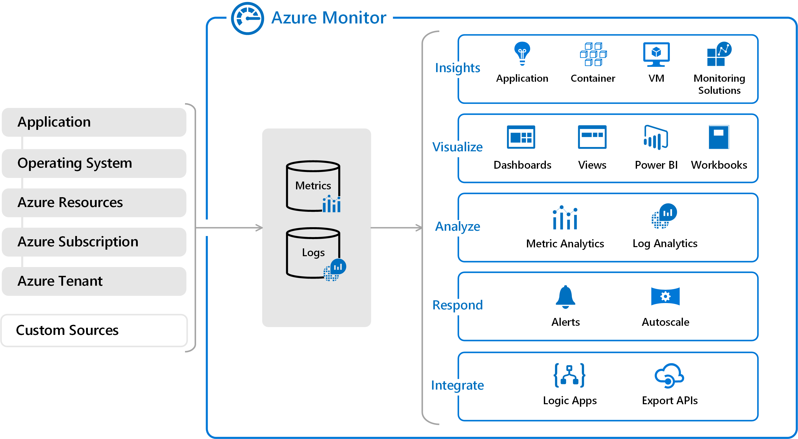
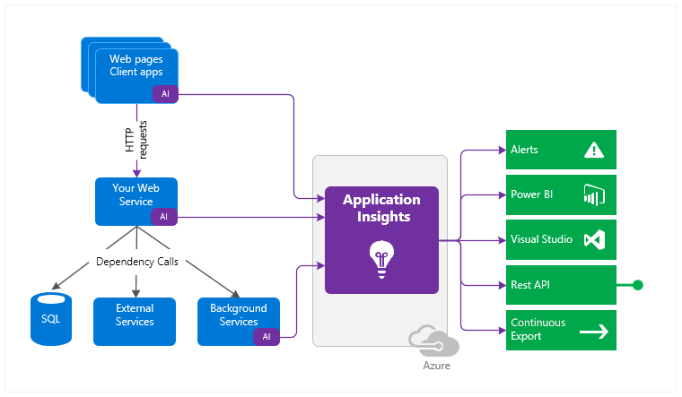
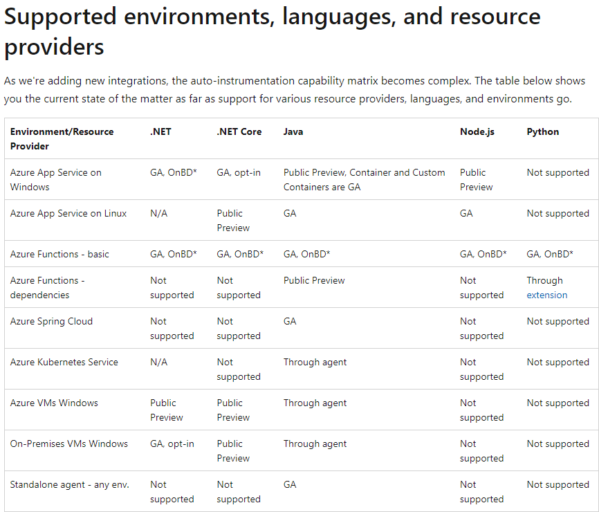
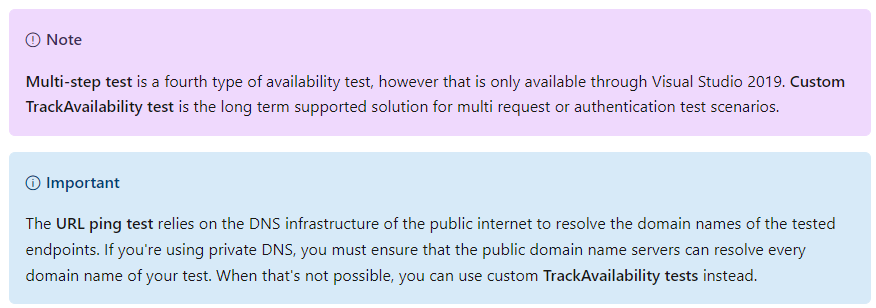
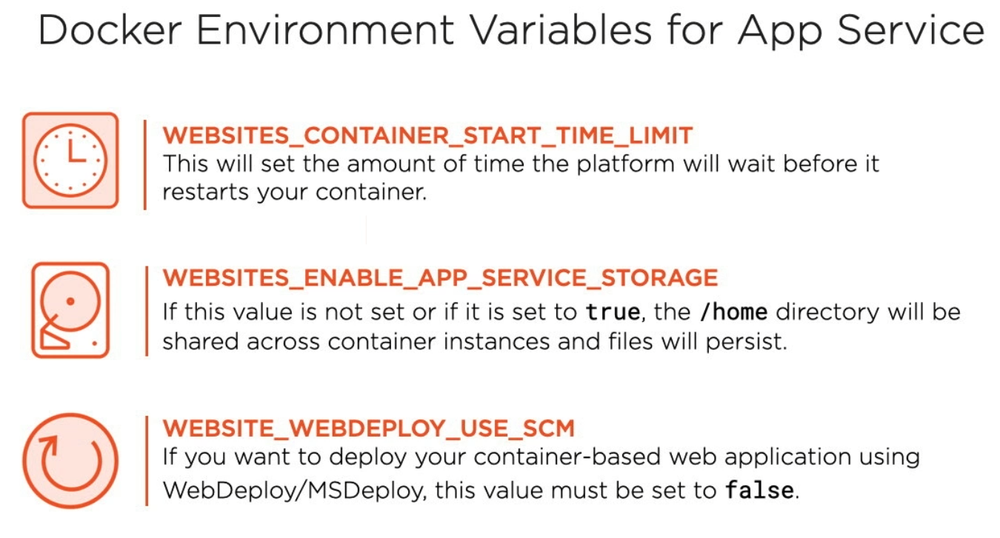

# Azure Monitor
- Azure Monitor delivers a comprehensive solution for collecting, analyzing, and acting on telemetry from your
  cloud and on-premises environments
- This information helps you understand how your applications are performing and proactively identify issues affecting 
  them and the resources they depend on

.

Azure monitor can collect data from any REST client that allows to create custom monitoring scenarios, including on-premises solutions
Azure Monitor collects data from each of the following tiers:
- **Application monitoring data**: Data about the performance and functionality of the code you have written, regardless 
  of its platform
- **Guest OS monitoring data**: Data about the operating system on which your application is running. This could be running
  in Azure, another cloud, or on-premises.
- **Azure resource monitoring data**: Data about the operation of an Azure resource
- **Azure subscription monitoring data**: Data about the operation and management of an Azure subscription, as well as 
  data about the health and operation of Azure itself
- **Azure tenant monitoring data**: Data about the operation of tenant-level Azure services, such as Azure Active Directory

### Azure Monitor capabilities
- correlate infrastructure issues
- detect and diagnose issues across applications and dependencies
- support operations with smart alerts and automated actions
- create visualizations with Azure dashboards and workbooks

## Explore Application Insights
- Application Insights, a feature of Azure Monitor, is an extensible Application Performance Management (APM) service for 
  developers and DevOps professionals
- It will automatically detect performance anomalies, and includes powerful analytics tools
- [Supported platforms and frameworks](https://docs.microsoft.com/en-us/azure/azure-monitor/app/platforms):
  - Azure Service Integration (Portal Enablement, ARM Deployments)
    - Azure VM and Azure virtual machine scale sets
    - Azure App Service
    - Azure Functions
    - Azure Cloud Services, including both web and worker roles
  - Auto-instrumentation (enable without code changes)
    - ASP.NET - for web apps hosted with IIS
    - ASP.NET Core - for web apps hosted with IIS
    - Java
  - Manual instrumentation / SDK (some code changes required)
    - many, but not Java :D 
- How Application Insights works:
  - **Manual instrumentation** - You install a small instrumentation package (SDK) in your application
  - **Auto-instrumentation** - enable Application Insights using the Application Insights Agent when supported
- You can instrument not only the web service application, but also any background components, and the JavaScript in the web pages themselves
- The application and its components can run anywhere - it doesn't have to be hosted in Azure

## What Application Insights monitors
- **Request rates**, response times, and failure rates - Find out which pages are most popular, at what times of day, 
  and where your users are. See which pages perform best. If your response times and failure rates go high when there 
  are more requests, then perhaps you have a resourcing problem.
- **Dependency rates**, response times, and failure rates - Find out whether external services are slowing you down.
- **Exceptions** - Analyze the aggregated statistics, or pick specific instances and drill into the stack trace and 
  related requests. Both server and browser exceptions are reported.
- **Page views and load performance** - reported by your users' browsers.
- **AJAX calls from web pages** - rates, response times, and failure rates.
- **User and session counts**
- **Performance counters** from your Windows or Linux server machines, such as CPU, memory, and network usage.
- **Host diagnostics** from Docker or Azure.
- **Diagnostic trace logs** from your app - so that you can correlate trace events with requests.
- **Custom events and metrics** that you write yourself in the client or server code, to track business events such as 
  items sold or games won

## Discover metrics
There are two kinds of metrics:
- **Log-based metrics** 
  - behind the scene are translated into Kusto queries from stored events
  - have more dimensions, which makes them the superior option for data analysis and ad-hoc diagnostics
- **Standard metrics** 
  - are stored as pre-aggregated time series
  - have better performance at query time
  - better choice for dashboarding and in real-time alerting

## Instrument an app for monitoring
### Auto-instrumentation

## Select an availability test
- You can set up availability tests for any HTTP or HTTPS endpoint that's accessible from the public internet
- You don't have to make any changes to the website you're testing. In fact, it doesn't even have to be a site that you own
- You can create up to 100 availability tests per Application Insights resource, and there are three types of availability tests
  - **URL ping test (classic)**: You can create this simple test through the portal to validate whether an endpoint is 
    responding and measure performance associated with that response. You can also set custom success criteria coupled 
    with more advanced features, like parsing dependent requests and allowing for retries.
  - **Standard test (Preview)**: This single request test is similar to the URL ping test. It includes SSL certificate 
    validity, proactive lifetime check, HTTP request verb (for example GET, HEAD, or POST), custom headers, and custom
    data associated with your HTTP request.
  - **Custom TrackAvailability test**: If you decide to create a custom application to run availability tests, you can
    use the TrackAvailability() method to send the results to Application Insights.

## Troubleshoot app performance by using Application Map
- Application Map helps you spot performance bottlenecks or failure hotspots across all components of your distributed application
- Each node on the map represents an application component or its dependencies; and has health KPI and alerts status
- If your app uses Azure services, you can also click through to Azure diagnostics, such as SQL Database Advisor recommendations
- Components are independently deployable parts of your distributed/microservices application. Developers and operations teams
  have code-level visibility or access to telemetry generated by these application components
  - Components are different from "observed" external dependencies such as SQL, Event Hubs, etc. which your team/organization 
    may not have access to (code or telemetry)
  - Components run on any number of server/role/container instances
  - Components can be separate Application Insights instrumentation keys (even if subscriptions are different) or 
    different roles reporting to a single Application Insights instrumentation key. The preview map experience shows the
    components regardless of how they are set up

